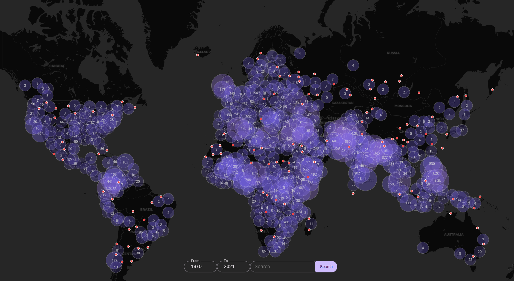

# Map of the University of Maryland Global Terrorism Database

A MapLibre + Solid + Vite map (sans data) of the GTD.

At present, the GTD covers 1970 to 2022.



## Usage

### Data

You will need to request permission from the University of Maryland for the GTD download. 

Place the contents of the zip into the `python` directory.

### DB

To create the browser-hosted SQLite in `public/`:

```bash
    cd python
    venv Scipts/activate
    pip install -r requirements
    python parse.py
```

### Fonts

The package at git@github.com:openmaptiles/fonts.git contains PBFs for fonts for cluster labels.

Manually fetch the dist and copy into `public/fonts` the `Open Sans Regular/` directory.

### Client

In the project root:

    bun install
    bun dev
